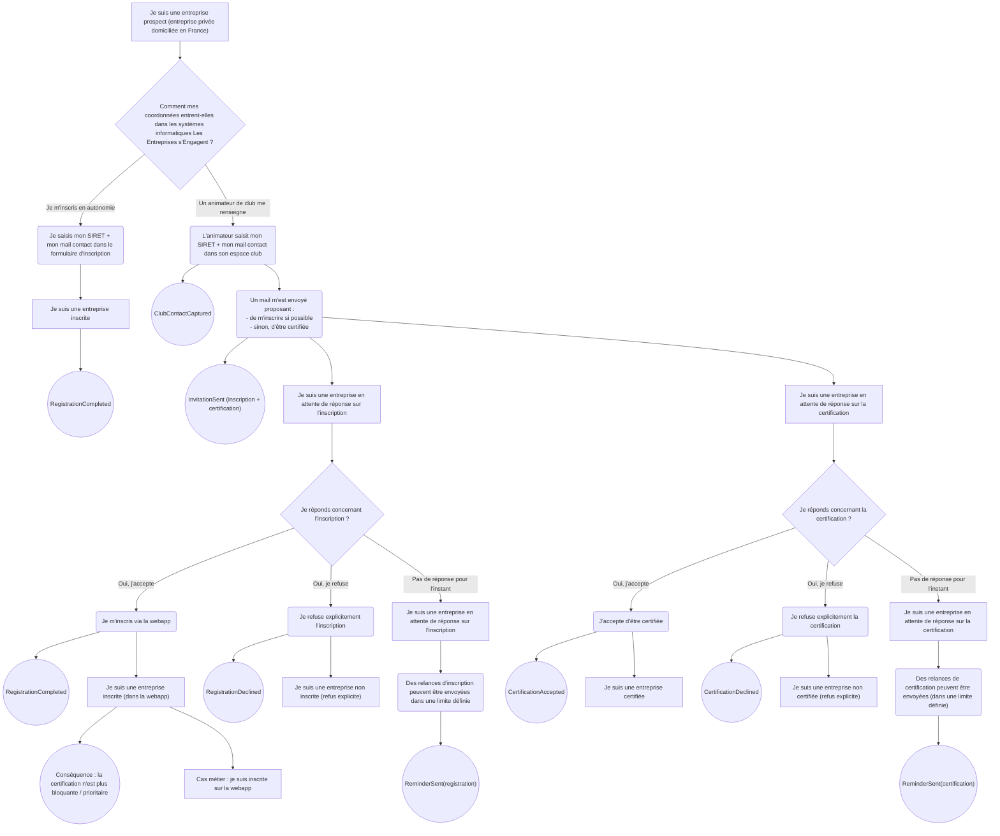
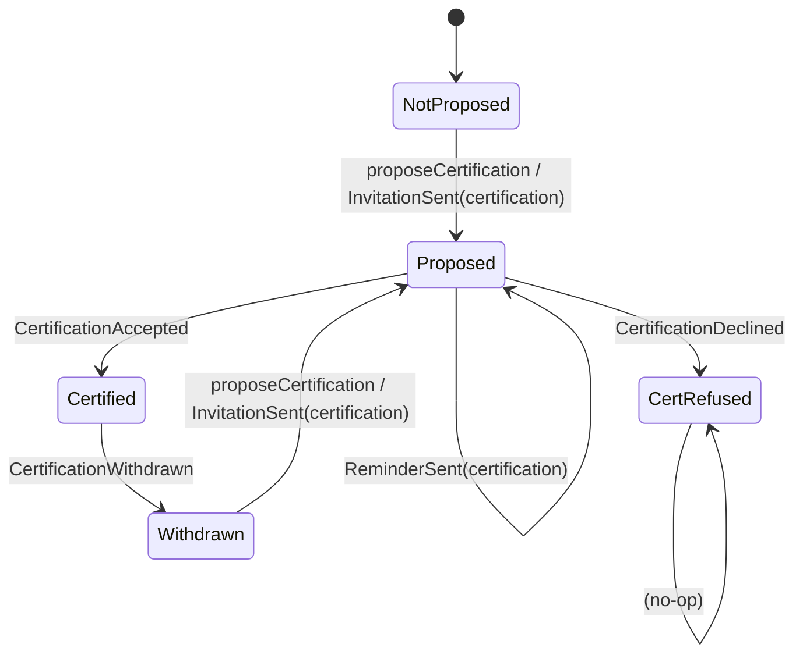

## Table d'états “A”, liés à l’inscription à la webapp

## Diagramme d’états “A”

## Table d'états “B”, liés à la “certification”

## États liés à l'inscription (A)

| Clé état (tech) | Cas métier | Implications principales |
|-----------------|------------|--------------------------|
| NoInvite | L'entreprise n'a pas été invitée à s'inscrire à la webapp | |
| Invited | Un email a été envoyé à l'entreprise lui proposant de s'inscrire sur la webapp. Elle n'a pas encore répondu. | Relances d'inscription possibles. |
| Registered | L'entreprise a créé un compte et est inscrite sur la webapp. | Pas de relances, accès au service. |
| RegRefused | L'entreprise a explicitement refusé de s'inscrire sur la webapp | Ne pas relancer sur l'inscription. |
| Unregistered | L'entreprise était inscrite mais a supprimé ou désactivé son compte. | À cadrer : modalités d'invitations nouvelles |

## États liés à la certification (B)

| Clé état (tech) | Cas métier | Implications principales |
|-----------------|------------|--------------------------|
| NotProposed | La certification n'a pas encore été proposée à l'entreprise. | |
| Proposed | Un email a été envoyé proposant à l'entreprise d'être certifiée. Elle n'a pas encore répondu. | Relances de certification possibles. |
| Certified | L'entreprise a accepté d'être certifiée et reconnue comme membre actif de la communauté. | Comptabilisée comme membre. |
| CertRefused | L'entreprise a explicitement refusé la certification. | Ne plus relancer sur la certification. |
| Withdrawn | L'entreprise était certifiée mais a retiré son accord (ou a été retirée). | Ne plus la compter comme certifiée. |

## Combinaisons des états (inscription × certification)

| État "inscription" | État "certification" | Cas métier |
|-------------------|---------------------|------------|
| A0 NoInvite | B0 NotProposed | Prospect |
| A1 Invited | B1 Proposed | Entreprise invitée, en attente de réponses (inscription + certif). Cas typique "saisie par un animateur de club" |
| A2 Registered | * (n'importe) | Entreprise inscrite (webapp). La certification n'a pas d'importance |
| A3 RegRefused | B2 Certified | Entreprise "certifiée non inscrite", ne pas relancer sur l'inscription |
| A1 Invited | B2 Certified | Entreprise "certifiée", inscription pas encore refusée, relances possibles sur l'inscription |
| A3 RegRefused | B3 CertRefused | Entreprise "en dehors/hermétique", refus des deux, ne plus contacter |
| A1 Invited | B3 CertRefused | Entreprise ayant refusé la certification, inscription pas refusée explicitement mais très probable |
| A0 NoInvite | B2 Certified | Cas pas censé arrivé |

## Événements principaux

| Clé événement (tech) | Libellé | Source principale |
|---------------------|---------|-------------------|
| ClubContactCaptured | Les coordonnées d'une entreprise ont été saisies par un animateur de club | Animateur de club |
| InvitationSent | Un email proposant l'inscription et/ou la certification a été envoyé | Système |
| ReminderSent(registration) | Une relance concernant l'inscription a été envoyée | Système |
| ReminderSent(certification) | Une relance concernant la certification a été envoyée | Système |
| RegistrationCompleted | L'entreprise s'est inscrite sur la webapp | Entreprise |
| RegistrationDeclined | L'entreprise a explicitement refusé l'inscription | Entreprise |
| CertificationAccepted | L'entreprise a accepté d'être certifiée | Entreprise |
| CertificationDeclined | L'entreprise a explicitement refusé la certification | Entreprise |
| UnsubscribeWebapp | L'entreprise s'est désinscrite de la webapp | Entreprise |
| CertificationWithdrawn | La certification de l'entreprise a été retirée ou annulée | Entreprise / Admin |
| ReminderStopped (optionnel) | Les relances ont été arrêtées pour cette entreprise | Système |
