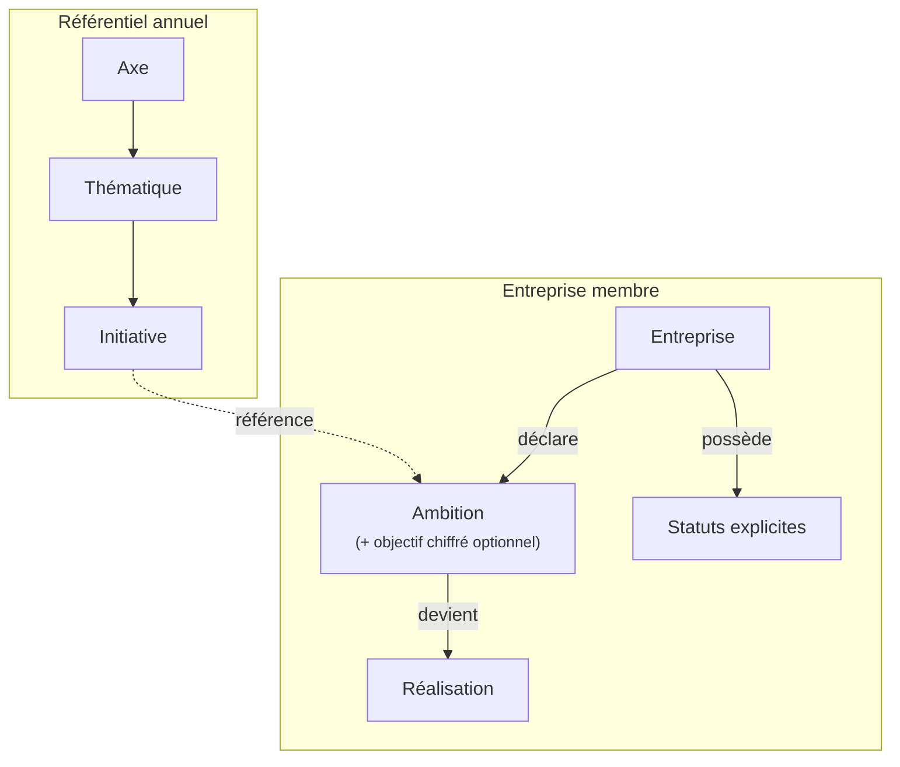
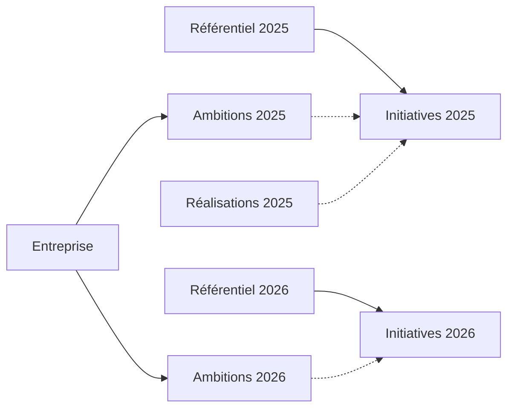

# Proposition ontologique

## Principes directeurs

Cette proposition s'appuie sur cinq principes fondamentaux :

- **Univocité sémantique** : Chaque concept du domaine doit porter un nom unique et non ambigu. Un même terme ne peut pas désigner plusieurs réalités.
- **Hiérarchie maîtrisée** : La structure du référentiel ne doit pas excéder trois niveaux de profondeur (Axe > Thématique > Initiative).
- **États explicites** : Tout statut métier (inscrit, certifié...) doit être modélisé explicitement et non déduit.
- **Alignement des vocabulaires** : Le même terme doit être utilisé dans le code, les interfaces et les échanges métier.
- **Versionnement du référentiel** : Chaque année dispose de son propre référentiel, permettant un suivi historique cohérent.

## Nouveau vocabulaire



### Distinction des concepts aujourd'hui confondus

Le mot "engagement" doit disparaître du plus de contextes possibles au profit de concepts distincts et précis :

#### Initiative
Élément atomique du référentiel qu'une `Entreprise membre` peut choisir d'adopter. C'est l'entrée du catalogue, indépendante de toute entreprise. Le terme remplace les appellations actuelles "Engagement" (Prisma) et "SubCommitment" (Hygraph).

> *Exemple : "Accueillir des stagiaires de 3ème issus de quartiers prioritaires"*

#### Ambition
Déclaration d'intention d'une Entreprise membre sur une `Initiative`, pour une année donnée. L'`Ambition` peut être accompagnée d'un `Objectif chiffré`. Elle remplace la notion actuelle d'"engagement pris".

> *Exemple : "En 2026, notre entreprise a l'ambition d'accueillir des stagiaires de 3ème"*

#### Réalisation
Accomplissement effectif d'une `Ambition`, déclaré lors du bilan annuel. Elle remplace la notion actuelle d'"engagement réalisé".

> *Exemple : "Nous avons accueilli 12 stagiaires de 3ème en 2025"*

#### Axe
Orientation stratégique regroupant plusieurs `Thématiques` sous une même vision. Ce concept correspond aux "quatre chapeaux" en cours de définition. Il devient le niveau supérieur du référentiel.

> *Exemples : "Travailler autrement", "Recruter autrement", "Former autrement", "Entreprendre autrement"*

### Ce qui reste inchangé

#### Thématique
Catégorie regroupant des `Initiatives` liées à un même domaine d'action. Le terme et le concept sont conservés.

> *Exemples : "Sobriété énergétique", "Inclusion des jeunes", "Égalité professionnelle"*

### Ce qui disparaît

#### Objective (entité Hygraph)

L'entité `Objective` Hygraph n'est pas un objectif métier mais un **prompt de formulaire** (ex: *"Combien de jeunes peuvent être recrutés cette année ?"*). Elle est supprimée :

- Le `label` (question) devient un attribut de l'`Initiative`
- La valeur saisie devient un attribut de l'`Ambition`

L'objectif chiffré n'est donc plus une entité distincte mais un simple couple question/valeur porté par l'`Initiative` et l'`Ambition`.

> *Exemple : L'Initiative "Recruter des jeunes" porte la question "Combien de jeunes peuvent être recrutés cette année ?". L'Ambition de l'entreprise X pour 2026 contient `objectifValeur: 15`.*

## Structure du référentiel

### De quatre à trois niveaux

La structure actuelle présente quatre niveaux, auxquels les "quatre axes" ajouteraient un cinquième :

```
Axe (nouveau)
  └── Thématique (ActionsCategory)
        └── Sous-thématique (SubActionsCategory)
              └── Engagement (SubCommitment)
                    └── Objectif (prompt de formulaire)
```

La proposition supprime le niveau Sous-thématique pour aboutir à une hiérarchie à trois niveaux :

```
Axe
  └── Thématique
        └── Initiative
```

Les sous-thématiques actuelles seront soit fusionnées avec leur thématique parente, soit promues au rang de thématique autonome, selon leur pertinence.

### Traitement des sous-thématiques existantes

Trois cas de figure se présentent :

- **Sous-thématique à engagement unique** : fusion avec la thématique parente
- **Sous-thématique riche** : promotion au rang de thématique
- **Sous-thématique contextuelle** : conversion en attribut de l'Initiative (tag)

### Exemple concret

Structure actuelle :
```
Thématique : Inclusion
  └── Sous-thématique : Jeunes
        └── Engagement : Accueillir des stagiaires
        └── Engagement : Recruter des alternants
  └── Sous-thématique : Handicap
        └── Engagement : Atteindre 6% de BOETH
```

Structure proposée :
```
Axe : Recruter autrement
  └── Thématique : Inclusion des jeunes
        └── Initiative : Accueillir des stagiaires de 3ème
        └── Initiative : Recruter des alternants
  └── Thématique : Emploi et handicap
        └── Initiative : Atteindre 6% de bénéficiaires de l'obligation d'emploi
```

## États explicites

Une entreprise membre possède deux statuts indépendants :

- **Statut d'inscription** : relation technique avec la webapp (non invitée → invitée → inscrite/refusée/désinscrite)
- **Statut de certification** : reconnaissance métier comme membre de la communauté (non proposée → proposée → certifiée/refusée/retirée)

Ces deux dimensions sont **orthogonales**. Une entreprise peut être inscrite sans être certifiée, certifiée sans être inscrite, ou les deux.

> **Documentation détaillée** : Les machines à états, les diagrammes de transitions et les combinaisons possibles sont décrits dans [Cycles de vie](./04-cycles-de-vie.md).

## Versionnement du référentiel

### Principe

Chaque année dispose de son propre référentiel. Les `Ambitions` et `Réalisations` sont liées au référentiel de leur année.



### Bénéfices

- **Bilans cohérents** : le bilan de l'année N se fait sur le référentiel de l'année N
- **Historique préservé** : les déclarations passées restent lisibles
- **Évolutions libres** : le référentiel peut évoluer sans casser l'existant

## Terminologie canonique

Pour lever toute ambiguïté dans les échanges, les termes suivants doivent être utilisés sous leur forme complète :

- **Entreprise membre** (et non "membre" ou "organisation")
- **Organisation professionnelle** (et non "organisation" seul)
- **Personne contact** (et non "contact" quand on parle d'un individu)
- **Club territorial** (et non "club" quand le contexte n'est pas clair)
- **Animateur club** (et non "animateur" seul)
- **Initiative** (et non "engagement" ou "action")

## Impact sur la communication

### Recommandations pour l'interface

- "Prenez vos engagements" → "Déclarez vos ambitions" ou "Choisissez vos ambitions"
- "Engagements réalisés" → "Ambitions concrétisées" ou "Réalisations"
- "Entreprises engagées" → "Entreprises de la Communauté" ou "Entreprises certifiées"

### Exemples de formulations

> "Rejoignez les 110 000 entreprises de la Communauté Les Entreprises s'Engagent."

> "Déclarez vos ambitions pour 2026 et suivez vos réalisations année après année."

> "Votre entreprise a concrétisé 4 ambitions sur 5, soit 80% de vos objectifs."

*Suite : [Glossaire unifié](./03-glossaire.md)*
