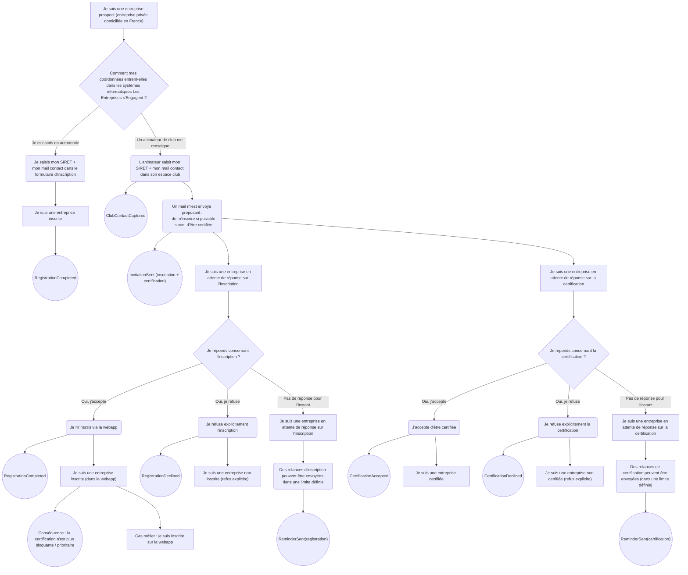
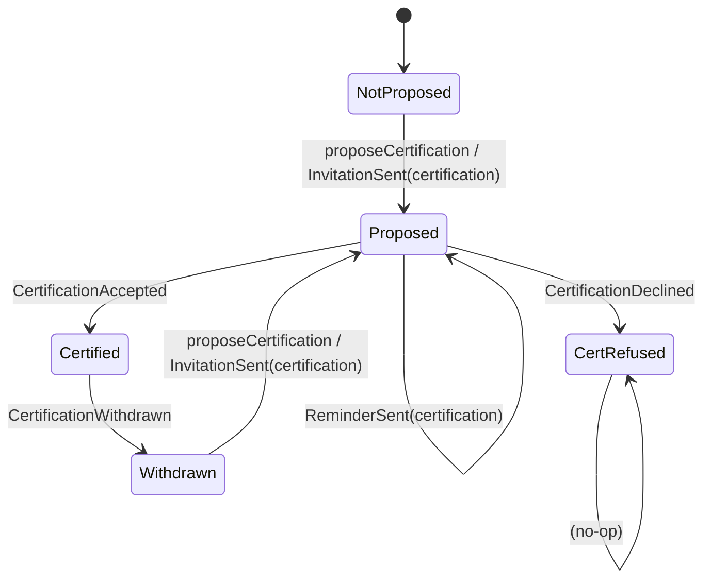

# Cycles de vie

> Machines à états pour l'inscription et la certification des entreprises.

## Préambule

Ces diagrammes décrivent les cycles de vie proposés pour gérer explicitement les statuts d'une Entreprise membre. Ils remplacent les états aujourd'hui implicites (déduits de la présence de dates ou d'emails).

Les deux dimensions sont **indépendantes** : une entreprise possède à la fois un statut d'inscription et un statut de certification.

## Vue d'ensemble des parcours

Le schéma suivant illustre les différents parcours possibles pour une entreprise prospect :

---

## Cycle d'inscription

Le statut d'inscription décrit la relation technique entre l'entreprise et la webapp.

### Diagramme d'états

### Table des états

| Clé état (tech) | Cas métier | Implications principales |
|-----------------|------------|--------------------------|
| `NoInvite` | L'entreprise n'a pas été invitée à s'inscrire à la webapp. | État initial. |
| `Invited` | Un email a été envoyé à l'entreprise lui proposant de s'inscrire sur la webapp. Elle n'a pas encore répondu. | Relances d'inscription possibles. |
| `Registered` | L'entreprise a créé un compte et est inscrite sur la webapp. | Pas de relances, accès au service. |
| `RegRefused` | L'entreprise a explicitement refusé de s'inscrire sur la webapp. | Ne pas relancer sur l'inscription. |
| `Unregistered` | L'entreprise était inscrite mais a supprimé ou désactivé son compte. | À cadrer : modalités d'invitations nouvelles. |

### Événements déclencheurs

| Événement | Description | Source |
|-----------|-------------|--------|
| `InvitationSent(registration)` | Un animateur saisit les coordonnées, ou l'Équipe nationale lance une campagne. | Système |
| `RegistrationCompleted` | L'entreprise crée son compte via le formulaire et accède à la webapp. | Entreprise |
| `RegistrationDeclined` | L'entreprise décline explicitement l'invitation à rejoindre la plateforme. | Entreprise |
| `ReminderSent(registration)` | Relance envoyée à une entreprise invitée n'ayant pas répondu. | Système |
| `UnsubscribeWebapp` | L'entreprise demande la suppression de son compte ou le désactive. | Entreprise |

---

## Cycle de certification

Le statut de certification décrit la reconnaissance métier de l'entreprise au sein de la communauté.

### Diagramme d'états

### Table des états

| Clé état (tech) | Cas métier | Implications principales |
|-----------------|------------|--------------------------|
| `NotProposed` | La certification n'a pas encore été proposée à l'entreprise. | État initial. |
| `Proposed` | Un email a été envoyé proposant à l'entreprise d'être certifiée. Elle n'a pas encore répondu. | Relances de certification possibles. |
| `Certified` | L'entreprise a accepté d'être certifiée et reconnue comme membre actif de la communauté. | Comptabilisée comme membre. |
| `CertRefused` | L'entreprise a explicitement refusé la certification. | Ne plus relancer sur la certification. |
| `Withdrawn` | L'entreprise était certifiée mais a retiré son accord (ou a été retirée). | Ne plus la compter comme certifiée. |

### Événements déclencheurs

| Événement | Description | Source |
|-----------|-------------|--------|
| `InvitationSent(certification)` | L'entreprise est invitée à être reconnue comme membre actif. | Système |
| `CertificationAccepted` | L'entreprise accepte et apparaît comme membre de la communauté. | Entreprise |
| `CertificationDeclined` | L'entreprise décline explicitement la proposition. | Entreprise |
| `ReminderSent(certification)` | Relance envoyée à une entreprise proposée n'ayant pas répondu. | Système |
| `CertificationWithdrawn` | La certification est retirée (à l'initiative de l'entreprise ou par décision de l'équipe). | Entreprise / Admin |

---

## Combinaisons des statuts

Les deux statuts évoluent indépendamment. Une entreprise possède toujours une valeur pour chacun des deux.

### Matrice des états

| État inscription | État certification | Cas métier |
|------------------|-------------------|------------|
| `NoInvite` | `NotProposed` | **Prospect pur.** L'entreprise n'a pas encore été approchée. |
| `Invited` | `Proposed` | **Invitée en attente.** Cas typique : saisie par un animateur de club. |
| `Registered` | * (n'importe) | **Inscrite.** L'entreprise a créé son compte. La certification devient secondaire. |
| `RegRefused` | `Certified` | **Certifiée non inscrite.** Reconnue membre via un club, sans compte webapp. Cas fréquent pour les petites structures. |
| `Invited` | `Certified` | **Certifiée, inscription en attente.** Relances possibles sur l'inscription. |
| `Registered` | `Certified` | **Membre complet.** Inscrite sur la webapp et reconnue comme membre actif. |
| `RegRefused` | `CertRefused` | **Hermétique.** Refus des deux propositions, ne plus contacter. |
| `Invited` | `CertRefused` | Certification refusée, inscription pas encore refusée explicitement mais très probable. |
| `NoInvite` | `Certified` | **Cas anormal** : ne devrait pas arriver. |

---

## Règles de gestion

### Relances

- Le nombre maximum de relances et le délai entre relances sont paramétrables.
- Un état de refus explicite (`RegRefused`, `CertRefused`) bloque définitivement les relances sur le sujet concerné.
- Les relances peuvent être différenciées selon le canal initial (auto-inscription, club, campagne).

### Priorité inscription vs certification

- Lorsqu'une entreprise est **inscrite** (`Registered`), la certification devient secondaire (l'entreprise peut déclarer ses promesses directement).
- La certification reste pertinente pour les entreprises qui ne souhaitent pas créer de compte mais veulent être reconnues comme membres de la communauté.

### Transitions interdites

- Une entreprise désinscrite ne peut pas revenir directement à l'état `Registered` (elle doit repasser par `Invited`).
- Une entreprise ayant refusé ne peut pas être automatiquement réinvitée (intervention manuelle requise).

### Traçabilité

- Chaque changement d'état doit être horodaté.
- L'événement déclencheur doit être conservé (qui, quand, comment).
- L'historique des états doit être accessible pour le pilotage.

---

## Événements récapitulatifs

| Clé événement (tech) | Libellé | Source |
|---------------------|---------|--------|
| `ClubContactCaptured` | Les coordonnées d'une entreprise ont été saisies par un animateur de club. | Animateur de club |
| `InvitationSent` | Un email proposant l'inscription et/ou la certification a été envoyé. | Système |
| `ReminderSent(registration)` | Une relance concernant l'inscription a été envoyée. | Système |
| `ReminderSent(certification)` | Une relance concernant la certification a été envoyée. | Système |
| `RegistrationCompleted` | L'entreprise s'est inscrite sur la webapp. | Entreprise |
| `RegistrationDeclined` | L'entreprise a explicitement refusé l'inscription. | Entreprise |
| `CertificationAccepted` | L'entreprise a accepté d'être certifiée. | Entreprise |
| `CertificationDeclined` | L'entreprise a explicitement refusé la certification. | Entreprise |
| `UnsubscribeWebapp` | L'entreprise s'est désinscrite de la webapp. | Entreprise |
| `CertificationWithdrawn` | La certification de l'entreprise a été retirée ou annulée. | Entreprise / Admin |
| `ReminderStopped` | Les relances ont été arrêtées pour cette entreprise (optionnel). | Système |

*Retour au [sommaire](./index.md)*
